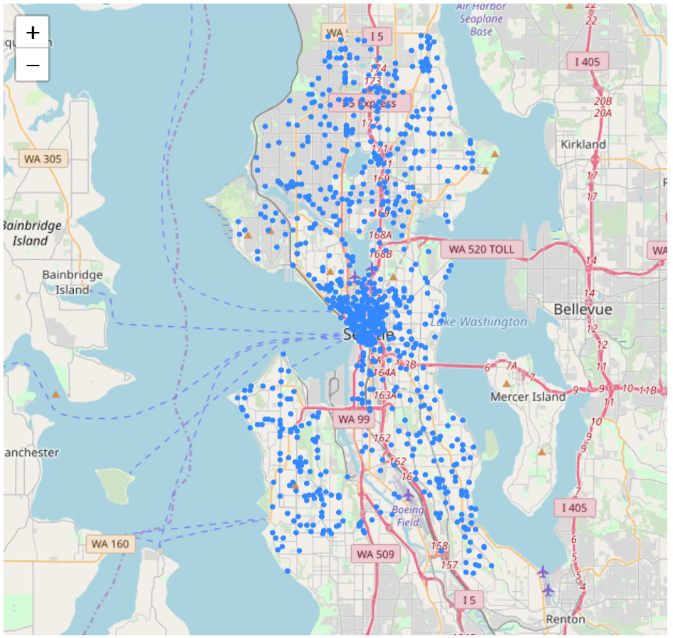

# Hot Spot Analysis on Seattle 911 Calls Data

## Introduction

For this project, I identified the hot spots for 911 emergencies based on geolocations. The main methods I used are K-means and DBSCAN (Density-based spatial clustering of applications with noise) clustering. This project is aimed to provide some actionable insights of the 911 calls in Seattle to improve the current resource allocation. The key stakeholders in this project include:
1. City government
2. Seattle Public
3. Settle Police
4. Federal government
5. Companies that run map services such as Google/Apple

The data source is from the [open data program](http://www.seattle.gov/tech/initiatives/open-data) by the City of Seattle. The real time 911 calls dataset I'm using is from [public safety category](https://data.seattle.gov/Public-Safety/Seattle-Real-Time-Fire-911-Calls/kzjm-xkqj). This dataset updates every 5 minutes, and I fetched the 911 calls from June 29, 2010 to October 31, 2018.

## Data Pre-processing

First, I used SSMS(MS SQL Server) to perform ETL and data cleaning process. Since the original data is well-formed, I deleted data with Null values in [Datetime] column, and removed replicated data and invalid data by queries as below.

```sql
Select [Datetime],SUBSTRING([Datetime], 1,2) As [Month],SUBSTRING([Datetime], 4,2) As [Date], 
SUBSTRING([Datetime], 7,4) As [Year], SUBSTRING([Datetime], 13,11) As [Time],
Address,Type,Latitude,Longitude,Report_Location,Incident_Number 
from 
(SELECT Address,Type,Latitude,Longitude,Report_Location,Incident_Number,
[Datetime] from Seattle_Real_Time_Fire_911_Calls
                  WHERE [Datetime]  LIKE '%PM%' or [Datetime]  LIKE '%AM%')   a
Union
Select [Datetime],SUBSTRING([Datetime], 7,2) As [Month],SUBSTRING([Datetime], 10,2) As [Date], 
SUBSTRING([Datetime], 2,4) As [Year], SUBSTRING([Datetime], 13,8) As [Time] ,
Address,Type,Latitude,Longitude,Report_Location,Incident_Number
from 
(SELECT [Datetime],Address,Type,Latitude,Longitude,Report_Location,Incident_Number from Seattle_Real_Time_Fire_911_Calls
                  WHERE [Datetime]  LIKE '%-%')   b
```

Before data pre-processing, there are 764,325 raw observations, with 191 incident types in the dataset. After the data cleaning process in SSMS, there're 750,725 valid records, with 8 mian incident types ready to be used. After this step, the dataset looks like that:


We may find that the datetime in this raw dataset is not unified. For example, datetime before transformation: “2011-11-06T24:46:00+0000”, “01/01/2011 01:05:00 PM +0000”. Therefore, I used Python to convert the DateTime into a standard format in the dataset. After transformation, the Datetime column is formatted into Year (2011-2018), Month (1-12), Date (01-31), Time (00-23).

```python
#IPython is what we are using now to run the notebook
import IPython
print( "IPython version:      %6.6s (need at least 1.0)" % IPython.__version__)
# Numpy is a library for working with Arrays
import numpy as np
print( "Numpy version:        %6.6s (need at least 1.7.1)" % np.__version__)
# SciPy implements many different numerical algorithms
import scipy as sp
print( "SciPy version:        %6.6s (need at least 0.12.0)" % sp.__version__)
# Pandas makes working with data tables easier
import pandas as pd
print( "Pandas version:       %6.6s (need at least 0.11.0)" % pd.__version__)
# Module for plotting
import matplotlib 
print( "Mapltolib version:    %6.6s (need at least 1.2.1)" %
       matplotlib.__version__)
from matplotlib import cbook, mlab, pyplot as plt
# necessary for in-line graphics
# SciKit Learn implements several Machine Learning algorithms
import sklearn
print( "Scikit-Learn version: %6.6s (need at least 0.13.1)" % sklearn.__version__)
import os
```
IPython version:       6.2.1 (need at least 1.0)
Numpy version:        1.15.4 (need at least 1.7.1)
SciPy version:         1.1.0 (need at least 0.12.0)
Pandas version:       0.23.4 (need at least 0.11.0)
Mapltolib version:     3.0.1 (need at least 1.2.1)
Scikit-Learn version: 0.19.1 (need at least 0.13.1)

```python
#Load the csv file from SSMS to Python Jupyter Notebook
df= pd.read_csv('911_Call.csv',"rb",delimiter=',')
df.head()
```
```python
#Filter out call location out of Great Seattle area.
lon_min, lat_min, lon_max, lat_max = -122.4361, 47.4956, -122.2365, 47.7341
​
df = df[ (df['Longitude']>lon_min) & (df['Longitude']<lon_max) & (df['Latitude']>lat_min) & (df['Latitude']<lat_max) ]
​#Checking the head of the dataframe
df.head()
```
The data now looks like that:


Let's try to convert the Datetime column with a function.
```python
import datetime as dt

def my_to_datetime(date_str):
    if date_str[0:2] != '24':
        return pd.to_datetime(date_str).strftime('%H')
    else:
        date_str = '0' + date_str[2:]
        return pd.to_datetime(date_str).strftime('%H')
    return pd.to_datetime(date_str, format='%H') + \
           dt.timedelta(days=1)
df_hour = df
df_hour['Time'] = df_hour['Time'].apply(my_to_datetime)
```
Now, our dataset is ready to be used for exloratory data analysis.
## Exloratory Data Analysis
In this step, we will use aggregation method to get statistics from this dataset. First, let's look at the main incident types. In this project, we will focus on the top 8 incident types, which are
- Aid Response
- Medical Response
- Auto Fire Alarm
- Transportation to AMR
- Aid Response Yellow
- Automatic Fire Alarm Response
- Motor Vehicle Accident
- Automatic Medical Alarm
```python
Inc_Type= pd.read_csv('Incident_Type.csv',"rb",delimiter='\t')
Main_Type = Inc_Type.head(8)
Main_Type.plot.bar(x='Type', y='Incident_Number')
```


Next, let's use aggregation method to figure out the emergencies trend by time.

```python
# Find the trend for Medical Response emergencies.
df_medic = df_hour.loc[df_hour['Type'] == 'Medic Response']
df_medic.groupby(['Time', 'Type']).size().to_frame('count').reset_index()
# Find the trend for Transportation to AMR emergencies.
df_amr = df_hour.loc[df_hour['Type'] == 'Trans to AMR']
df_amr.groupby(['Time', 'Type']).size().to_frame('count').reset_index()
# Find the trend for Automatic Fire Alarm Response emergencies.
df_fire = df_hour.loc[(df_hour['Type'] == 'Auto Fire Alarm') | (df_hour['Type'] == 'Automatic Fire Alarm Resd')]
df_fire.groupby(['Month', 'Type']).size().to_frame('count').reset_index()
# Find the trend for Motor Vehicle Accidents.
df_motor = df_hour.loc[df_hour['Type'] == 'Motor Vehicle Accident']
df_motor.groupby(['Month', 'Type']).size().to_frame('count').reset_index()
# Find the trend for Motor Assault accidents.
df_assault = df_hour.loc[(df_hour['Type'] == 'Assault w/Weap 7 per Rule') | (df_hour['Type'] == 'Assault w/Weapons 14') | (df_hour['Type'] == 'Assault w/Weapons, Aid') | (df_hour['Type'] == 'Assault w/Weapons- Aid')]
df_assault.groupby(['Month', 'Type']).size().to_frame('count').reset_index()
```
Now, let's map the trends with line charts.
```python
plt.style.use('ggplot')
fig = plt.figure()
fig.set_size_inches(21,6)

plt.subplot(1,3,1)
popular_venues = df_medic.groupby(['Month']).size()
plt.plot(popular_venues.index, popular_venues)
plt.title('Medical Response Monthly Number')
plt.xlabel('Month')
plt.ylabel('Number of responses')

plt.subplot(1,3,2)
popular_venues = df_assault.groupby(['Time']).size()
plt.plot(popular_venues.index, popular_venues)
plt.title('Assault Hourly Number')
plt.xlabel('Hour')
plt.ylabel('Number of responses')


plt.subplot(1,3,3)
popular_venues = df_amr.groupby(['Year']).size()
plt.plot(popular_venues.index, popular_venues)
plt.title('Trans to AMR Yearly Number')
plt.xlabel('Year')
plt.ylabel('Number of responses')
plt.show()
```


According to these graphs, we may found some potential patterns as follows.
1. Medic Response vs. Month: medical accidents reach the peak in Summer.
2. Trans to AMR (transportation to the ambulance) vs. Year: Number of ambulance calls is increasing by the year.
3. Assault vs. Hour: Assault accidents reach the peak in at Midnight 2 am.
## Empirical Results
Now, let's try to map these data points based on geo locations.
```python
import folium
def plot_incidents(incidents):
    folium_map = folium.Map(location=[47.6036, -122.3294],
                            zoom_start=13)
    for index, row in incidents.iterrows():
        folium.CircleMarker(location=(row["Latitude"],
                                      row["Longitude"]),
                            radius=0.3,
                            
                            fill=True).add_to(folium_map)
    return folium_map
```
```python
data=df[ (df['Year']==2017)& (df['Month']==2) & (df['Type']=='Medic Response')]
plot_incidents(data)
```

```python
data=df[ (df['Year']==2017)& (df['Month']==8) & (df['Type']=='Medic Response')]
plot_incidents(data)
```

Here we can find that medical accidents reach the peak in Summer, potentially because of summer sport activities injuries.
```python
data=df[ (df['Year']==2017)& (df['Time']==2) & ((df['Type'] == 'Assault w/Weap 7 per Rule') | (df['Type'] == 'Assault w/Weapons 14') | (df['Type'] == 'Assault w/Weapons, Aid') | (df['Type'] == 'Assault w/Weapons- Aid')])
plot_incidents(data)
```

```python
data=df[ (df['Year']==2017)& (df['Time']==15) & ((df['Type'] == 'Assault w/Weap 7 per Rule') | (df['Type'] == 'Assault w/Weapons 14') | (df['Type'] == 'Assault w/Weapons, Aid') | (df['Type'] == 'Assault w/Weapons- Aid')])
plot_incidents(data)
```

Assaults are more likely to happen at Midnight 2am - potentially because people who drink at night get dizzy and easy to be attacked.
```python
data=df[ (df['Year']==2011)& ((df['Month']==6) |(df['Month']==7) |(df['Month']==8 ) & (df['Type']=='Trans to AMR')]
plot_incidents(data)
```

```python
data=df[ (df['Year']==2017)& ((df['Month']==6) |(df['Month']==7) |(df['Month']==8 ) & (df['Type']=='Trans to AMR')]
plot_incidents(data)
```

We may find that a huge increase in the number of ambulance calls from 2011 to 2017, potentially because average wage is higher and people can afford to call.

## Find the Centroids and Hot Spots for diffrent types of incidents
The main methods I'm using to find the hot spots are K-means clustering and DBSCAN(Density-based spatial clustering of applications with noise). We'll compare these two clustering methods in the next section. To make the question simpler, I focused on assaults accidents only in this section.
I first plot all assault accidents on the map and then find the best K value by elbow method. The y-axis score denotes the Sum of squared distances by the number of clusters. The y value is very small because the distance calculation is based on longitude and latitude, and the longitude and latitude don’t vary very much in the Seattle area. We can see as the number of clusters increase, the sum of squared distance tends to zero. I picked k = 9 as our cluster numbers. The sum of squared distance is 0.5534464292963854.
```python
data=df[((df['Type'] == 'Assault w/Weap 7 per Rule') | (df['Type'] == 'Assault w/Weapons 14') | (df['Type'] == 'Assault w/Weapons, Aid') | (df['Type'] == 'Assault w/Weapons- Aid')])
plot_incidents(data)
```

```python
data.shape
```
There are 69866 assault accidents happened from 2011 to 2018.
***K-means Clustering*** - Find Centroids for Assault Accidents
Here I used elbow method to find the optimum cluster numbers in K-means.

```python
from sklearn.cluster import KMeans
from sklearn import metrics
from sklearn.metrics import pairwise_distances

ml = KMeans(n_clusters=9, init='k-means++')
ml.fit(data_assault[['Longitude', 'Latitude']].sample(frac=0.3))
```
KMeans(algorithm='auto', copy_x=True, init='k-means++', max_iter=300,
    n_clusters=9, n_init=10, n_jobs=1, precompute_distances='auto',
    random_state=None, tol=0.0001, verbose=0)
```python
cluster = ml.cluster_centers_
cluster[:10]
``` 
array([[-122.334037  ,   47.6091105 ],
       [-122.27142452,   47.52703625],
       [-122.29863778,   47.72572526],
       [-122.37253894,   47.54151688],
       [-122.34468775,   47.70715062],
       [-122.30489134,   47.5513347 ],
       [-122.3766547 ,   47.6652    ],
       [-122.31049271,   47.66201916],
       [-122.309763  ,   47.59657254]])
```python
Nc = range(1, 21)

kmeans = [KMeans(n_clusters=i).fit(data_assault[['Longitude','Latitude']]) for i in Nc]

kmeans

score = [kmeans[i].inertia_ for i in range(len(kmeans))]

score
import pylab as pl
pl.plot(Nc,score)

pl.xlabel('Number of Clusters')

pl.ylabel('Sum_of_squared_distances')
pl.xticks(np.arange(0, 21, step=1))
pl.title('Elbow Curve')

pl.show()
```


```python
score
```
[7.492802758178552,
 3.6998630415371863,
 2.114346646810745,
 1.4054748923443734,
 1.0900591042448389,
 0.924166098239145,
 0.7618807725386647,
 0.6460056105942824,
 0.5534464292963854,
 0.4928816829148501,
 0.43543338267061704,
 0.3879116335644782,
 0.35567816182949963,
 0.3285201446767978,
 0.3022297278412547,
 0.278649212731908,
 0.2566252808208794,
 0.24237873402182158,
 0.22525528367655606,
 0.2175940754374689]
 ```python
data_assault['cluster'] = ml.predict(data_assault[['Longitude','Latitude']])
global_df = data_assault.groupby(['cluster']).size().reset_index()
global_df.columns = ['cluster','count']
idx = global_df.groupby(['cluster'])['count'].transform(max) == global_df['count']
idx.head()
topvenues_df = global_df[idx].sort_values(by="count", ascending=False)
clusters = pd.DataFrame(data = cluster,columns = ['Longitude','Latitude'])
result = pd.concat([topvenues_df, clusters], axis=1, join='inner',join_axes=[topvenues_df.index])
result
 ```

Then I clustered the data by location to form pseudo neighborhoods that are roughly defined the geography of where emergencies tend to happen.
```python
def plot_center(cleaned_data,points):
    folium_map = folium.Map(location=[47.6036, -122.3294],
                            zoom_start=13)
    colors = ['pink','blue','black','purple','green','lime','lime','blue','orange','blue','black','purple','green','lime']
    noise = cleaned_data[cleaned_data['dbscan_cluster']==-1]
    for index,row in noise.iterrows():
            folium.CircleMarker(location=(row["Latitude"],
                                          row["Longitude"]), radius=1,color = colors[row["cluster"]],fill=True).add_to(folium_map)
    for row in points:
        folium.CircleMarker(location=(row[1],row[0]), radius=5,color = "red",fill=True).add_to(folium_map)
    return folium_map
cleaned_data = data_assault.drop(["Report_Location"],axis = 1)
cleaned_data = cleaned_data.drop(["Incident_Number"],axis = 1)
plot_center(cleaned_data,points)
```

These colored clusters tend to pick out neighborhoods, and this works quite well in breaking up neighborhoods. The red circles represent the centroids of these clusters.
Next, I used Voronoi diagram to abstract the map.
```python
from scipy.spatial import Voronoi
points = cluster
vor = Voronoi(points)
import matplotlib.pyplot as plt
voronoi_plot_2d(vor)
plt.show()
```

Recommendation: We can set up emergency help centers near these centroids so that when emergencies came out, Seattle Police can get to the report location more quickly (Voronoi Diagram).
Next, let's use DBSCAN method on the same assault data.
***DBSCAN Clustering*** -  Identify the Hot Spots for Aid Responses 
Different from K-means clustering, DBSCAN is based on density. It’s more useful when we wanna pick up the hot spots (high-density area) of a certain incident type. DBSCAN ignores the noise points (which distributed uniformly and don’t vary too much) and identifies core points in clusters.
```python
from sklearn.cluster import DBSCAN
eps = 260/111034.61 #The maximum distance between two samples for them to be considered as in the same neighborhood.
db = DBSCAN(eps=eps, min_samples=15, n_jobs=1).fit(np.array(data_aid[['Longitude','Latitude']])) # atleast 15 points in a cluster
```
```python
core_samples_mask = np.zeros_like(db.labels_, dtype=bool)
core_samples_mask[db.core_sample_indices_] = True
data_assault['dbscan_cluster'] =  db.labels_
data_assault['dbscan_core']    = core_samples_mask
print("clusters: {}".format(len(set(data_aid['dbscan_cluster']))))
```
```python
data_assault.dbscan_cluster.unique()
```
```python
```
clusters: 9
As before, we used map to represent the hot spots identified by DBSCAN. The colored regions are identified as highly demanded areas in aid-response.

```python
def plot_center(cleaned_data,points):
    folium_map = folium.Map(location=[47.6036, -122.3294],
                            zoom_start=13)
    colors = ['yellow','blue','black','purple','green','lime','lime','blue','orange','blue','black','purple','green','lime']
    for k in range(0,9):
        hot_spots = cleaned_data[cleaned_data['dbscan_cluster']==k]
        for index,row in hot_spots.iterrows():
            folium.CircleMarker(location=(row["Latitude"], row["Longitude"]), radius=1,color = colors[row["dbscan_cluster"]],fill=True).add_to(folium_map)
    noise = cleaned_data[cleaned_data['dbscan_cluster']==-1]
    return folium_map
cleaned_data = data_aid.drop(["Report_Location"],axis = 1)
cleaned_data = cleaned_data.drop(["Incident_Number"],axis = 1)
plot_center(cleaned_data,points)
```

Recommendation: Seattle Police should maintain more frequent patrol in colored areas.
## Method comarison
Here I created an overlaped map to compare these two methods.

Yellow plot: noise of DBSCAN
Red circle: K-Means (k = 9)
Blue area: DBSCAN clustering (cluster number = 8)
(Threshold: at least 15 points in a cluster)


yellow plot: noise of DBSCAN
Red circle: K-Means (k = 10)
Blue area: DBSCAN clustering (cluster number = 9)
- For geo-clustering, the approach should depend on our goals and data distribution. Take assault accidents and aid responses as an example, we find that there are some well-shaped clusters in assaults plot map (slide 26), and points vary much in density. High-density points are concentrated in downtown, whereas some small clusters are distributed in other areas. Therefore, if we use DBSCAN, we would find the blue hotspots (slide 26) cannot pick up all dangerous locations, but K-means does a good job here. These data points on the aid response map seem more randomly distributed (slide 27), and we cannot even find these non-globular shapes clusters, which means K-means are not suitable. K-means are good to manipulate with linearly separated data, while DBSCAN is good for data that can be separated in a non-linear fashion. Besides, The densities don’t vary too much in these points, so DBSCAN is able to pick up the hot spots for aid response.
- Another difference between these two methods is their goals are different. K-means picks up the centroids for clusters based on distance, while DBSCAN identifies hot spots for clusters based on density. If we wanna find the centroids for a certain type of incident so that we can set up some local police station to serve in a small area and go to the report locations faster, we can use K-means. If we’re more interested to learn more about the hot spots (high-density locations) of a type of incidents, so that the Seattle Police could maintain more frequent patrol in these hot spots, DBSCAN is more suitable than K-means.

## Conclusion
Now, let's come to the conclusion of these two methods in geo-clustering applications.
K-Means Clustering advantages:
1. Good for datasets that have a small number of clusters with proportional sizes and linearly separable data
2. Easy and fast (scalable)

K-Means Clustering disadvantages:
1. Works only for ”well-shaped” clusters
2. Sensitive to outliers
3. Sensitive to noise

DBSCAN advantages:
1. Good for datasets that have disproportional cluster sizes, and whose data can be separated in a non-linear fashion
2. Works well for clusters of arbitrary shape
3. Can handle clusters of different shapes and sizes
4. Robust to noise
5. Deterministic

DBSCAN disadvantages:
1. Requires connected regions of sufficiently high density
2. Data sets with varying densities are problematic
